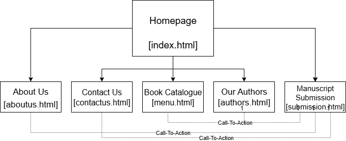

# Project Title: Trivest Publishing House Website

**Student Name:** Nkosinathi Ngema
**Student Number:** ST10489912
**Module:** WEDE5020 - Web Development (Introduction)

---

## Project Overview

The objective of this project is to create a professional and modern website for an organisation of our choice.
I decided to create a website for Trivest Publishing House, a smal publication company.
This website will feature the company's services and information on the company. It will increase it's online presence and provide information for users.

## Website Goals and Objectives

Number of submissions received through website
Number of sales through the website links
Growth in newsletter sign-ups

## Key Features and Functionality

- Responsive navigation menu
- About Us section with company history
- Services/Products showcase page
- Contact page with contact form

## Sitemap

## Timeline and Milestones

| Date | Milestone |
| :--- | :--- |
| [27 August 2025] | Part 1 Submission: HTML Structure & Proposal |
| [26 September 2025] | Part 2 Submission: CSS Styling |
| [19 November 2025] | Part 3 Submission: JavaScript & SEO |

## Part 1 Details

This section contains the initial HTML structure, project proposal, and content research for the website.

## Part 2 Screenshots

## Changelog

All notable changes to this project will be documented in this section.

| Date | Version | Description |
| :--- | :--- | :--- |
| 2025-08-18 | 0.1 | Created the folder structure and HTML pages. README.md file created.|
| 2025-08-19 | 0.2 | Added content to index.html and about.html. Created navigation links on all pages. |
| 2025-08-20 | 0.3 | Added forms to index.html, contactus.html, and submission.html. |
| 2025-08-21 | 0.4 | Added more content to menu.html and index.html. |
| 2025-08-22 | 0.5 | Added content to authors.html and aboutus.html. |
| 2025-08-23 | 0.6 | Added book covers to index.html and menu.html. |
| 2025-08-25 | 0.7 | Added footers to all the pages. |
| 2025-08-26 | 0.8 | Modified some content on all the footers and contactus.html. |
| 2025-09-01 | 0.9 | Created CSS file and started implemnting global styles. |
| 2025-09-03 | 1.0 | Started adding CSS styling to the index.html class. |
| 2025-09-04 | 1.1 | Continues adding CSS styling to the index.hmtl file, and also starting with the  contactus.html file. |
| 2025-09-06 | 1.2 | Finished styling on index.html and continued with contactus.html styling. |
| 2025-09-07 | 1.3 | Finished styling on the contactus.html file. |
| 2025-09-14 | 1.5 | Started styling on aboutus.html. |
| 2025-09-16 | 1.6 | Finished styling aboutus.html, and started submission.html. |
| 2025-09-17 | 1.7 | Started styling authors.html while still styling submission.html. |
| 2025-09-19 | 1.8 | Finished stying submission.html. |
| 2025-09-20 | 1.9 | Finished styling authors.html and started styling menu.html. |
| 2025-09-23 | 2.0 | Finished styling menu.html. |
| 2025-09-24 | 2.1 | Changed the styling of the header and the footer. |
| 2025-09-26 | 2.2 | Added a few touchups before submission. |
| 2025-10-16 | 2.3 | Created the JS file, and linked all the pages to it. |
| 2025-10-18 | 2.4 | Added the accordion style to the main class. |
| 2025-10-19 | 2.5 | Added author tabs to index.html. |
| 2025-10-21 | 2.6 | Added the functionality code of the accordion style to the JS file. |
| 2025-10-24 | 2.7 | Started working  on the the lightbox gallery box. |
| 2025-10-25 | 2.8 | Finished the gallery box code. |
| 2025-10-29 | 2.9 | Started working on the search functionality and map code in JS. |
| 2025-10-29 | 3.0 | Finished work on the search functionality and map code in JS. |
| 2025-11-01 | 3.1 | Started work on form validation across all pages. |
| 2025-11-06 | 3.2 | Finished work on form validation. |
| 2025-11-09 | 3.3 | Started working on AJAX. |
| 2025-11-11 | 3.4 | Finished work on AJAX. |
| 2025-11-14 | 3.5 | Reviewed all my code and ensured everything ran correctly.| 
## References

​​Afrihost, 2025. Domains. [online] Available at: < <https://www.afrihost.com/domains> > [Accessed 07 August 2025].

​Afrihost, 2025. Cloud Hosting. [Online] Available at: < <https://www.afrihost.com/cloud-hosting> > [Accessed 07 August 2025]. ​​

W3Schools, 2025. *HTML Tutorial*. [online] Available at: < <https://www.w3schools.com/html/> > [Accessed: 25 August 2025].